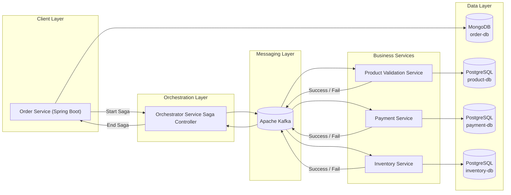

# Arquitetura de Microsserviços: Padrão Saga Orquestrado


Este repositório documenta **estudos práticos em Arquitetura de Microsserviços**, com foco no **Padrão Saga Orquestrado**, utilizado para garantir consistência de dados em sistemas distribuídos baseados em eventos.

O objetivo é **didático e exploratório**, não representando um ambiente produtivo.

---

## 📑 Sumário

- [Visão Geral](#-visão-geral)
- [Tecnologias Utilizadas](#-tecnologias-utilizadas)
- [Arquitetura da Solução](#-arquitetura-da-solução)
- [Serviços da Arquitetura](#-serviços-da-arquitetura)
- [Execução do Projeto](#-execução-do-projeto)
- [Acesso](#-acesso)
- [Observações](#-observações)

---

## 🔍 Visão Geral

O padrão **Saga Orquestrado** coordena transações distribuídas por meio de um **serviço central de orquestração**, responsável por controlar o fluxo, estados e compensações entre microsserviços.

---

## 🚀 Tecnologias Utilizadas

- **Java 25**
- **Spring Boot 4.0**
- **Apache Kafka**
- **API REST**
- **PostgreSQL**
- **MongoDB**
- **Docker**
- **Docker Compose**
- **Redpanda Console**

---

## 🧱 Arquitetura da Solução

A arquitetura abaixo substitui diagramas estáticos tradicionais, utilizando **Mermaid**, o que permite versionamento, melhor leitura e renderização nativa no GitHub.



---

## 🧩 Serviços da Arquitetura

- **Order-Service**  
  Inicia a saga e expõe endpoints REST.  
  Banco: MongoDB

- **Orchestrator-Service**  
  Controla estados, sequência e compensações da saga.  
  Banco: N/A

- **Product-Validation-Service**  
  Valida produtos do pedido.  
  Banco: PostgreSQL

- **Payment-Service**  
  Processa pagamentos.  
  Banco: PostgreSQL

- **Inventory-Service**  
  Controla estoque.  
  Banco: PostgreSQL

---

## ▶️ Execução do Projeto

```bash
docker-compose up --build -d
```

Requisitos:
- Docker
- Java 25
- Gradle 8+

---

## 🌐 Acesso

- Swagger (Order-Service): http://localhost:3000/swagger-ui.html
- Redpanda Console: http://localhost:8081

---

## ⚠️ Observações

- Projeto com foco **educacional**
- Estrutura voltada para compreensão do padrão Saga
- Não indicado para produção sem ajustes arquiteturais

---

## 👤 Autor

**Rafael Junio Moraes**  
Desenvolvedor Back-End / Full-Stack  
